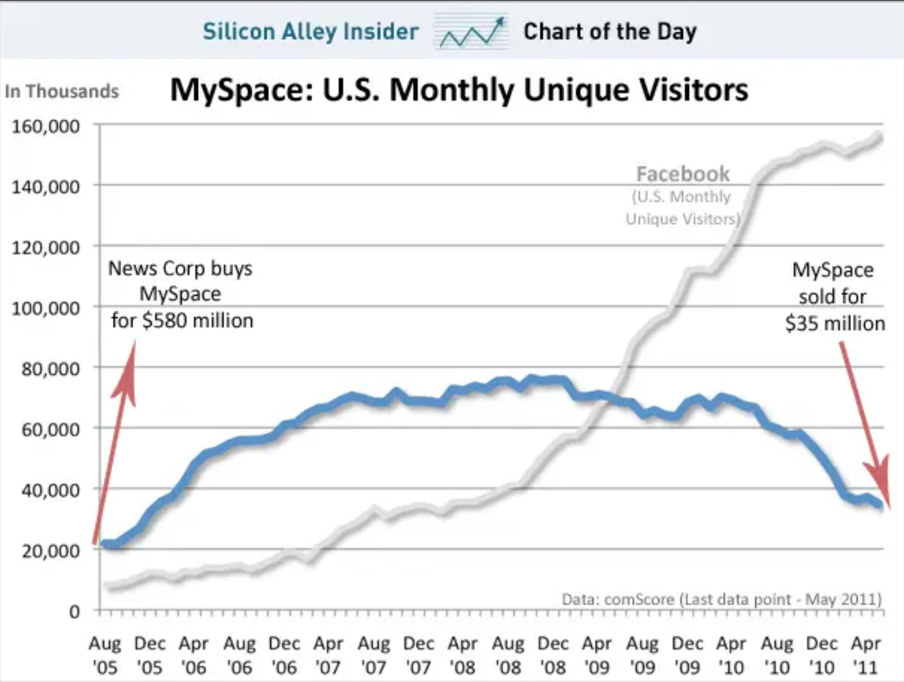
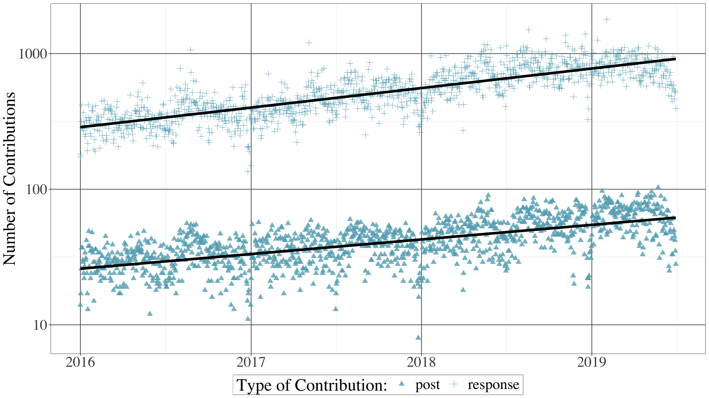
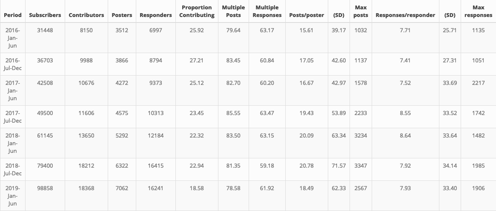
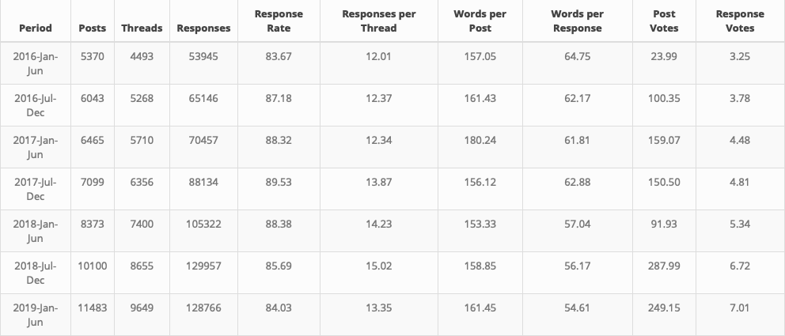
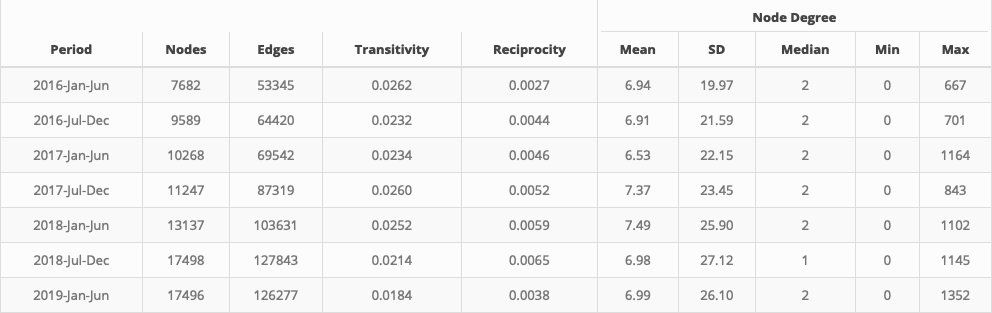

```{r setup, include=FALSE}
usethis::use_git_ignore(c("*.csv", "*.rds"))
options(htmltools.dir.version = FALSE)

#titleSlideClass: [inverse, center, middle]
#"default", "metropolis", "metropolis-fonts", 

# see options for customize slides: 
# https://slides.yihui.name/xaringan/
# https://slides.yihui.name/xaringan/incremental.html
# https://github.com/yihui/xaringan/wiki

library(knitr)
library(tidyverse)
library(xaringan)
```

class: inverse, center, middle

# View Slides

[bretsw.github.io/site20-reddit](https://bretsw.github.io/site20-reddit)

---

class: inverse, center, middle

# Social Media in Education

---

# Social Media in Education

### Teachers' professional learning

```{r, out.width = "720px", echo = FALSE, fig.align = "center"}
include_graphics("img/teacher.jpg")
```

---

# Social Media in Education

### The times they are a-changin'

```{r, out.width = "720px", echo = FALSE, fig.align = "center"}
include_graphics("img/across-time-full.jpg")
```

---

# Social Media in Education

### The rise and fall of Myspace

```{r, out.width = "600px", echo = FALSE, fig.align = "center"}

```

[*Image source: Business Insider (2011)*](https://www.businessinsider.com/chart-of-the-day-the-fall-of-myspace-2011-6)

---

class: inverse, center, middle

# Purpose

---

# Purpose

### Reddit, over time

To investigate *continuity and change* in how users contribute, interact, and converse over time in a teaching-related subreddit

```{r, out.width = "600px", echo = FALSE, fig.align = "center"}
include_graphics("img/across-time-full.jpg")
```

---

class: inverse, center, middle

# Framework

---

# Framework

### Affinity spaces within Reddit

```{r, out.width = "600x", echo = FALSE, fig.align = "center"}
include_graphics("img/network.jpg")
```

---

class: inverse, center, middle

# Reddit Background

---

# Reddit Background

```{r, out.width = "240px", echo = FALSE, fig.align = "center"}
include_graphics("img/reddit-logo.png")
```

--

1. \#6 website in the United States; \#18 in the world

--

1. Collection of discussion forums (i.e., **subreddits**)

--

1. Threaded discussions: **posts** and **responses**

--

1. Voting: **+1** or **-1**

--

1. Anonymity

---

# Reddit Background

```{r, out.width = "720px", echo = FALSE, fig.align = "center"}
include_graphics("img/reddit-example.jpg")
```

---

# Reddit Background

```{r, out.width = "240px", echo = FALSE, fig.align = "center"}
include_graphics("img/reddit-logo.png")
```

### Teaching-related subreddits

--

Affinity spaces for teachers:

--

* Education in general (e.g., r/education)

--

* Education level (e.g., r/highereducation)

--

* Subject area (e.g., r/historyteachers, r/matheducation, r/MusicEd)

---

# r/Teachers

### High participation, teaching-related subreddit 

**https://www.reddit.com/r/Teachers/**

```{r, out.width = "720px", echo = FALSE, fig.align = "center"}
include_graphics("img/teacher.jpg")
```

---

class: inverse, center, middle

# Research Questions

---

# Research Questions

```{r, out.width = "360", echo = FALSE, fig.align = "center"}
include_graphics("img/question.jpg")
```

--

### How has the r/Teachers subreddit changed over time? 

We explored continuity and change across 3.5 years of activity in the r/Teachers subreddit in three dimensions: 
--

* individual contributions

--

* content interactions

--

* social interactions

---

class: inverse, center, middle

# Method

---

# Method

```{r, out.width = "240px", echo = FALSE, fig.align = "center"}
include_graphics("img/reddit-logo.png")
```

### Data collection

--

* **r/Teachers** subreddit

--

* 3.5 years (42 months), from January 1, 2016 and June 30, 2019

--

* 696,660 contributions from 55,148 contributors

--

  * Total of 54,933 posts and 641,727 responses 

---

# Method

```{r, out.width = "240px", echo = FALSE, fig.align = "center"}
include_graphics("img/reddit-logo.png")
```

### Data analysis

--

* Split data into 7 six-month partitions

--

* Then performed quantitative analysis of:

--

  * individual contributions

--

  * content interactions

--

  * social interactions

---


class: inverse, center, middle

# Results

---

#Results

### Individual contributions

* slope of the **post** linear regression line: **0.03** (*p* < .001)
* slope of the **response** linear regression line: **0.49** (*p* < .001) 

```{r, out.width = "720px", echo = FALSE, fig.align = "center"}

```

---

#Results

### Individual contributions

* overall numbers of subscribers, contributors, posters, and responders all trended upward
* recent growth in **observers** (i.e., lurkers)
* increased contributions from **super-users**

```{r, out.width = "840px", echo = FALSE, fig.align = "center"}

```

---

#Results

### Content interactions

* response rate, responses per thread, words per post, and words per response all appeared to be fairly consistent
* mean voting scores for both posts and responses increased steadily

```{r, out.width = "840px", echo = FALSE, fig.align = "center"}

```

---

#Results

### Social interactions

* the number of **nodes** (i.e., contributors) and **edges** (i.e., responses) grew
* node **degree** remained consistent
* **transitivity** decreased, meaning network connections became more evenly spread (i.e., less clustered)
* **reciprocity** increased, meaning fewer hierarchical relationships

```{r, out.width = "840px", echo = FALSE, fig.align = "center"}

```

---

class: inverse, center, middle

# Discussion

---

# Discussion

* r/Teachers has seen continuity, gradual change, and dramatic change by various measures

--

* as r/Teachers has grown, social interactions have become less clustered and more mutual

--

* teaching-related subreddits present various opportunities and challenges for novice teacher learning

--

* anonymity is a double-edged sword

--

  * opportunities for new teachers to engage in forms of identity play as they try on their new professional identities

--

  * comfortable space to process and ask questions without professional scrutiny

--

  * unknown sources of help mean needing to develop critical dispositions

---

class: inverse, center, middle

# Conclusion

---

# Conclusion

```{r, out.width = "480px", echo = FALSE, fig.align = "center"}
include_graphics("img/across-time-full.jpg")
```

--

* social media platforms continue to grow in popularity and potential utility for teachers’ professional practice

--

* but, even with growth, there is evidence of both continuity and change over time, as measured by a variety of features

--

* more related work is needed!

---

class: inverse, left, top

# Questions?

* **Email:** [staudtwi@msu.edu](mailto:staudtwi@msu.edu)

* **Twitter:** [@bretsw](https://twitter.com/bretsw)

* **Web:** [bretsw.com](http://bretsw.com)

* **Slides:** [bretsw.github.io/site20-reddit](https://bretsw.github.io/site20-reddit)

* **R code:** [github.com/bretsw/r-teachers](https://github.com/bretsw/r-teachers)